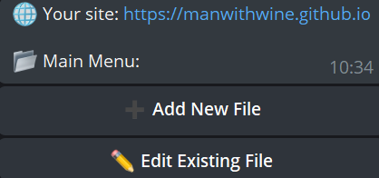
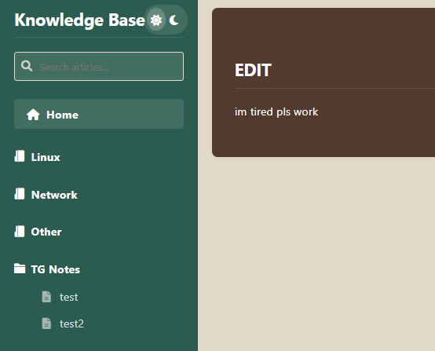

# Хранилка статей и полезностей

Честно признаться, не знаю, на сколько этично брать инфу с разных ресурсов, но обещаю везде указывать source.

Еще из прикольного - как тут работает (по крайней мере для меня, ибо сделал такую штуку впервые):
1. Gitlab хранит код с телеграм ботом и пушит его на сервер через runner, каждый раз, когда я делаю какие-то изменения
2. На сервере этом крутится сам сервис с тгботом и логированием
3. Доступ до бота через пароль и вот как выглядит интерфейс:\

4. Есть возможность добавит или изменить файл в формате .md\
Куда и в какую папку назначаю тегами # 
5. Изменения прилетают в Github 
6. В Github срабатывает workflow и обновляет Github Pages
7. Все изменения отображаются на сайте:\

## А зачем так?
Почему все не сделать через Github?

## ... большие города...
Просто захотелось так :)\
Хотелось практики - я её получил